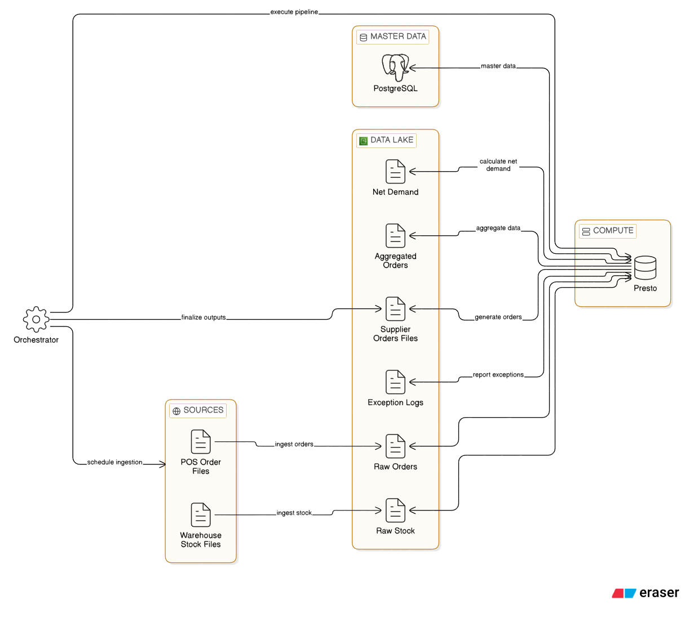
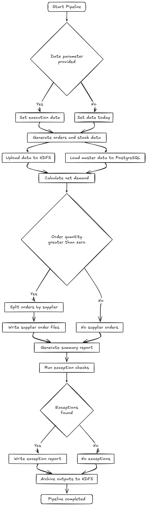
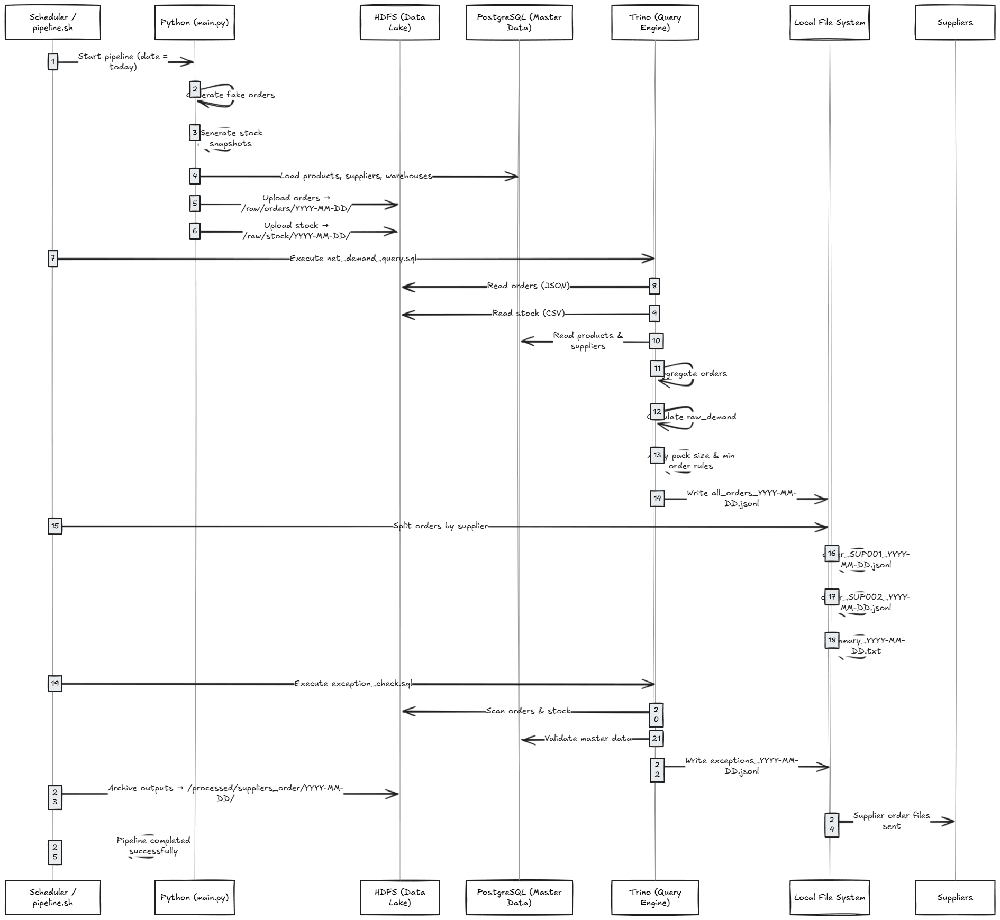
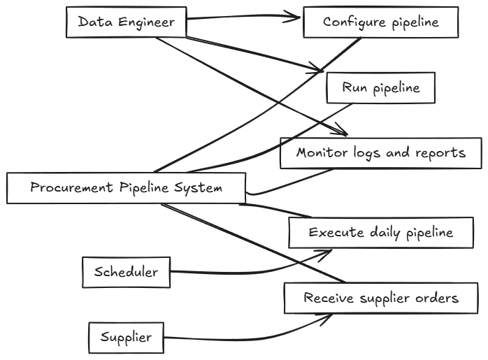

# Procurement Data Pipeline

## Architecture Overview



## useful diagrams

---

### activate diagram



### sequence diagram



### use case diagram



---

## 📋 Table of Contents

- [Project Overview](#project-overview)
- [Architecture](#architecture)
- [Prerequisites](#prerequisites)
- [Project Structure](#project-structure)
- [Components Explained](#components-explained)
- [How to Run](#how-to-run)
- [Understanding the Outputs](#understanding-the-outputs)
- [Technical Details](#technical-details)
- [Troubleshooting](#troubleshooting)

---

## 🎯 Project Overview

This project implements a **simplified batch-oriented data pipeline** for a retail procurement system. The pipeline automates the daily process of calculating what products need to be ordered from suppliers based on:

- **Customer orders** (daily demand)
- **Warehouse inventory** (current stock levels)
- **Product master data** (supplier info, safety stock, ordering rules)

### Business Problem

Retail stores need to replenish products daily to ensure:

- Products are always available for customers
- Stock levels don't run too low (safety stock)
- Orders respect supplier constraints (minimum order quantity, pack sizes)
- Ordering is automated and data-driven

### Solution

An automated data pipeline that:

1. Collects daily orders and inventory data
2. Calculates net demand using procurement formulas
3. Generates supplier-specific order files
4. Performs data quality checks
5. Archives everything for audit and reprocessing

---

## 🏗️ Architecture

### High-Level Architecture

```
┌─────────────────┐
│  Data Sources   │
├─────────────────┤
│ • POS Orders    │────┐
│ • Warehouse     │    │
│ • Master Data   │    │
└─────────────────┘    │
                       ↓
              ┌────────────────┐
              │  Data Lake     │
              │    (HDFS)      │
              ├────────────────┤
              │ /raw/orders/   │
              │ /raw/stock/    │
              └────────────────┘
                       ↓
              ┌────────────────┐
              │  Query Engine  │
              │    (Trino)     │
              ├────────────────┤
              │ • Aggregation  │
              │ • Joins        │
              │ • Calculations │
              └────────────────┘
                       ↓
              ┌────────────────┐
              │  Outputs       │
              ├────────────────┤
              │ Supplier Orders│
              │ Exception Rpt  │
              │ Summary        │
              └────────────────┘
                       ↓
              ┌────────────────┐
              │  Archive       │
              │  (HDFS)        │
              ├────────────────┤
              │ /processed/    │
              └────────────────┘
```

### Technology Stack

| Layer                   | Technology       | Purpose                                              |
| ----------------------- | ---------------- | ---------------------------------------------------- |
| **Storage**       | HDFS             | Distributed file system for raw and processed data   |
| **Database**      | PostgreSQL       | Stores master data (products, suppliers, warehouses) |
| **Query Engine**  | Trino            | Distributed SQL queries across HDFS and PostgreSQL   |
| **Orchestration** | Bash Script      | Coordinates pipeline execution                       |
| **Data Format**   | JSON/JSONL & CSV | Interchange formats                                  |
| **Container**     | Docker           | Runs Hadoop, Trino, PostgreSQL                       |

---

## ✅ Prerequisites

### Software Requirements

- **Docker Desktop** (with Docker Compose)
- **Git Bash** (for Windows) or regular Bash (Linux/Mac)
- **Python 3.8+** (for data generation)

---

### install required packages

```bash
python -m venv venv # to init a venv in python setup
```

```bash
pip install -r requirements.txt
```

---

### Docker Containers Running

```bash
# Your docker-compose should have:
- namenode (HDFS)
- datanode (HDFS)
- trino (Query engine) # Query engine to make the quieres of sql fast (distributed)
- postgres (Master data)
```

---

## 📁 Project Structure

```
procurement-pipeline/
│
├── pipeline.sh                            # Main pipeline orchestration script
├── main.py                                # ingest and generate entrypoint
├── assets/                                # diagrams for more project documentation
|   ├── activ_diag.png                     # active diagram 
|   ├── architecture.png                   # project overview
|   ├── seq_diag.png                       # sequence diagram
|   └──  use_case_diag.png                  # use case diagram
|
|
├── config/                                # config for postgres & hive & trino
|   ├── hive/  
|   ├── postgres/
|   |    ├── init.sql                      # init file (hive metastore and tables creation)
|   |    └── postgresql.jar                # jar file to run the container of postgreSQL  container
|   ├── trino/
|   |    ├── catalog/                      # catalog to monitor trino behavior and how to connect 
|   |    |    ├── hive.properties          # connect properties for hive connection
|   |    |    └── postgresql.properties    # connect properties for postgres connection
|   |    └── hdfs/                         # hdfs connection settings
|   |         ├── config-site.xml    
|   |         ├── core-site.xml   
|   |         └── hdfs-site.xml   
|   ├── config.properties  
|   ├── jvm.config 
|   └── node.properties
|  
| 
|
├── sql/
│   ├── trino_init.sql              # Database schema creation
│   ├── net_demand_query.sql        # Core procurement calculation query
│   └── exception_check.sql         # Data quality checks
|
|
├── output/
│   └── supplier_orders/
│       └── YYYY-MM-DD/
│           ├── all_orders_YYYY-MM-DD.jsonl
│           ├── order_SUP001_YYYY-MM-DD.jsonl
│           ├── order_SUP002_YYYY-MM-DD.jsonl
│           └── YYYY-MM-DD.txt
|
|
├── logs/
│   └── exceptions/
│       └── YYYY-MM-DD_exceptions.jsonl
|
|
├── src/                             # src code for the ingest and generate data
|    ├── data_generation/            # data generation
|    |    ├── utils/                 # utils helpers for data generation
|    |    └── generate_data.py       # main generate data entrypoint
|    └── ingestion/                  # ingest data 
|         ├── utils/                 # utils helper for data ingestion
|         └── ingest.py              # main ingest data entrypoint 
|
|
├── tmp/                             # Temporary files (auto-cleaned)
├── data/
|   ├── master/
|   |    ├──  products.csv           # products in the warehouses
|   |    ├──  suppliers.csv          # suppliers in the warehouses
|   |    └──  warehouses.csv         # warehouses for the poses
|   └── raw/
|        ├── orders/                 # orders from the pos 
|        └── stock/                  # stock snapshot 
|
|
└── README.md                        # This file
```

---

## 🔧 Components Explained

### 1. Data Generation (`main.py`)

**Purpose**: Simulates daily operational data

**What it generates**:

- **Orders**: Customer purchases from different stores (POS data)
- **Inventory**: End-of-day stock levels in warehouses
- **Master Data**: Products, suppliers, warehouses (static reference data)

**Output locations**:

- Orders → HDFS: `/raw/orders/YYYY-MM-DD/*.jsonl`
- Stock → HDFS: `/raw/stock/YYYY-MM-DD/*.csv`
- Master Data → PostgreSQL tables

**Example Order File** (`/raw/orders/YYYY-MM-DD/order_001.jsonl`):

```json
{
  "order_id": "ORD12345", "sku-id": "SKU001","quantity_ordered": 25,"orders_date": "YYYY-MM-DD"
}
```

**Example Stock File** (`/raw/stock/YYYY-MM-DD/warehouse_WH001.csv`):

```csv
warehouse_id,sku_id,available_quantity,reserved_quantity,stock_date
WH001,SKU001,150,20,YYYY-MM-DD
WH001,SKU002,75,10,YYYY-MM-DD
```

---

### 2. Database Schema (`config/postgres/init.sql`)

**Purpose**: Define master data structure in PostgreSQL

**Tables Created**:

#### **suppliers**

```sql
supplier_id | supplier_name           | contact_email        | lead_time_days
----------- | ----------------------- | -------------------- | --------------
SUP001      | Fresh Foods Supplier    | sup1@example.com     | 2
SUP002      | Dairy Products Inc      | sup2@example.com     | 1
```

#### **products**

```sql
| sku_id | category   | product_name   | supplier_id | pack_size | min_order_qty | unit_price | safety_stock |
| ------ | ---------- | -------------- | ----------- | --------- | ------------- | ---------- | ------------ |
| SKU001 | Fruits     | Organic Apples | SUP001      | 10        | 20            | 2.50       | 50           |
| SKU002 | Dairy      | Fresh Milk     | SUP002      | 6         | 12            | 3.20       | 30           |
| SKU003 | Vegetables | Carrots        | SUP003      | 5         | 10            | 1.80       | 40           |
```

#### **warehouses**

```sql
warehouse_id | warehouse_name      | location
------------ | ------------------- | -------------
WH001        | Central Warehouse   | City Center
WH002        | North Distribution  | North Zone
```

**Key Fields Explained**:

- `pack_size`: Products must be ordered in multiples of this (e.g., 10-packs)
- `min_order_qty`: Minimum quantity supplier will accept
- `safety_stock`: Buffer stock to prevent stockouts
- `lead_time_days`: How long delivery takes

---

### 3. Net Demand Calculation (`sql/net_demand_query.sql`)

**Purpose**: Calculate exactly how much to order from each supplier

**The Formula**:

```
net_demand = MAX(0, aggregated_orders + safety_stock - (available_stock - reserved_stock))
```

**Step-by-Step Logic**:

#### **Step 1: Aggregate Daily Orders**

```sql
-- Sum all customer orders per product
SELECT sku_id, SUM(quantity_ordered) as total_ordered
FROM orders
WHERE orders_date = 'YYYY-MM-DD'
GROUP BY sku_id
```

Example:

```
SKU001: 120 units ordered across all stores
SKU002: 45 units ordered
```

#### **Step 2: Get Current Inventory**

```sql
-- Sum stock levels across all warehouses
SELECT sku_id, 
       SUM(available_quantity) as total_available,
       SUM(reserved_quantity) as total_reserved
FROM warehouse_inventory
WHERE stock_date = 'YYYY-MM-DD'
GROUP BY sku_id
```

Example:

```
SKU001: 200 available, 30 reserved
SKU002: 50 available, 10 reserved
```

#### **Step 3: Join with Master Data**

```sql
-- Combine with product info (safety stock, supplier, pack size)
SELECT p.sku_id, p.supplier_id, p.safety_stock, p.pack_size, ...
FROM products p
LEFT JOIN aggregated_orders o ON p.sku_id = o.sku_id
LEFT JOIN inventory i ON p.sku_id = i.sku_id
```

#### **Step 4: Calculate Raw Net Demand**

```sql
-- Apply the procurement formula
raw_demand = MAX(0, 
    total_ordered + safety_stock - (total_available - total_reserved)
)
```

**Example Calculation for SKU001**:

```
Orders: 120
Safety Stock: 50
Available: 200
Reserved: 30

raw_demand = MAX(0, 120 + 50 - (200 - 30))
           = MAX(0, 120 + 50 - 170)
           = MAX(0, 0)
           = 0  ← Don't need to order (enough stock)
```

**Example Calculation for SKU002**:

```
Orders: 45
Safety Stock: 30
Available: 50
Reserved: 10

raw_demand = MAX(0, 45 + 30 - (50 - 10))
           = MAX(0, 75 - 40)
           = 35  ← Need to order 35 units
```

#### **Step 5: Apply Supplier Rules**

```sql
-- Round to pack size and respect minimum order quantity
CASE 
    WHEN raw_demand = 0 THEN 0
    WHEN raw_demand < min_order_qty THEN min_order_qty
    ELSE CEIL(raw_demand / pack_size) * pack_size
END as order_quantity
```

**Example for SKU002** (pack_size=6, min_order_qty=12):

```
raw_demand = 35
35 / 6 = 5.83 → CEIL = 6 packs
6 * 6 = 36 units

Final order_quantity = 36
```

---

### 4. Exception Checks (`sql/exception_check.sql`)

**Purpose**: Detect data quality issues that could cause problems

**Check 1: Missing Supplier Mappings**

```sql
-- Find SKUs in orders but not in products table
SELECT sku_id
FROM orders
LEFT JOIN products ON orders.sku_id = products.sku_id
WHERE products.sku_id IS NULL
```

**Why this matters**: Can't order products that don't exist in master data

**Check 2: Missing Inventory Data**

```sql
-- Find ordered SKUs without stock snapshots
SELECT sku_id
FROM orders
LEFT JOIN warehouse_inventory ON orders.sku_id = inventory.sku_id
WHERE inventory.sku_id IS NULL
```

**Why this matters**: Can't calculate net demand without knowing current stock

**Check 3: Abnormal Demand Spikes**

```sql
-- Find orders that are 5x higher than safety stock
SELECT sku_id, SUM(quantity_ordered) as demand
FROM orders
JOIN products ON orders.sku_id = products.sku_id
GROUP BY sku_id
HAVING SUM(quantity_ordered) > products.safety_stock * 5
```

**Why this matters**: Could indicate data errors or unusual events

---

### 5. Pipeline Orchestration (`pipeline.sh`)

**Purpose**: Execute all pipeline steps in correct order

**Execution Flow**:

```bash
[1/5] Data Generation & Ingestion
      ↓ python main.py
      Creates fake data → Uploads to HDFS
  
[2/5] Calculate Net Demand
      ↓ Trino SQL query
      Reads: orders + inventory + products
      Outputs: all_orders_YYYY-MM-DD.jsonl
  
[3/5] Split by Supplier
      ↓ Bash text processing
      Creates: order_SUP001_YYYY-MM-DD.jsonl (per supplier)
  
[4/5] Exception Report
      ↓ Trino SQL query
      Outputs: YYYY-MM-DD_exceptions.jsonl
  
[5/5] Summary Report
      ↓ Bash text generation
      Outputs: YYYY-MM-DD.txt
  
[6] Archive to HDFS
      ↓ Docker + HDFS commands
      Copies: outputs → /processed/suppliers_order/
```

---

## 🚀 How to Run

### First Time Setup

**1. Start Docker containers**

```bash
docker-compose up -d
```

**2. Create database schema**

```bash
# Connect to PostgreSQL
docker exec -it postgres psql -U postgres

# Run the schema creation script
\i sql/create_tables.sql
```

**3. Create Trino tables**

```bash
# Connect to Trino
docker exec -it trino trino

# Create external tables pointing to HDFS
-- Run the CREATE TABLE statements from your setup
```

### Daily Execution

**Run for YYYY-MM-DD**:

```bash
./pipeline.sh
```

**Run for specific date**:

```bash
./pipeline.sh YYYY-MM-DD
```

**What happens**:

1. ✅ Generates daily data (orders, inventory)
2. ✅ Uploads to HDFS
3. ✅ Calculates what to order
4. ✅ Creates supplier-specific files
5. ✅ Checks data quality
6. ✅ Archives results to HDFS

**Expected output**:

```
==============================================
Procurement Pipeline - YYYY-MM-DD
==============================================
Start time: YYYY-MM-DD 22:05:30
[1/5] Creating the data and ingest Stage
✓ Generated 500 orders
✓ Generated 50 inventory snapshots
✓ Data uploaded to HDFS

[2/5] Calculating net demand...
✓ Net demand calculated: 45 order lines

[3/5] Splitting orders by supplier...
  ✓ SUP001: 15 items
  ✓ SUP002: 18 items
  ✓ SUP003: 12 items
✓ Generated orders for 3 suppliers

[4/5] Generating exception report...
⚠ 2 exceptions detected

[5/5] Generating summary...

================================================
PROCUREMENT PIPELINE SUMMARY
================================================
Date: YYYY-MM-DD
Total Order Lines: 45
Suppliers Processed: 3
Exceptions Found: 2

==============================================
Pipeline completed successfully!
End time: YYYY-MM-DD 22:06:15
==============================================
```

---

## 📊 Understanding the Outputs

### 1. All Orders File

**File**: `output/supplier_orders/YYYY-MM-DD/all_orders_YYYY-MM-DD.jsonl`

**Content**: Complete list of all products to order (all suppliers combined)

**Format**: One JSON object per line

```json
{"supplier_id":"SUP001","supplier_name":"Fresh Foods","order_date":"YYYY-MM-DD","sku_id":"SKU001","product_name":"Organic Apples","pack_size":10,"min_order_qty":20,"unit_price":2.50,"daily_demand":120,"available_stock":200,"reserved_stock":30,"raw_demand":0,"order_quantity":0}
{"supplier_id":"SUP002","supplier_name":"Dairy Products","order_date":"YYYY-MM-DD","sku_id":"SKU002","product_name":"Fresh Milk","pack_size":6,"min_order_qty":12,"unit_price":3.20,"daily_demand":45,"available_stock":50,"reserved_stock":10,"raw_demand":35,"order_quantity":36}
```

**Use**: Complete record for analysis and auditing

---

### 2. Supplier Order Files

**Files**: `output/supplier_orders/YYYY-MM-DD/order_SUP001_YYYY-MM-DD.jsonl`

**Content**: Orders for ONE specific supplier only

**Format**: Same as all_orders but filtered

```json
{"supplier_id":"SUP001","supplier_name":"Fresh Foods","order_date":"YYYY-MM-DD","sku_id":"SKU003","product_name":"Bananas","order_quantity":50,"pack_size":10,"unit_price":1.80}
{"supplier_id":"SUP001","supplier_name":"Fresh Foods","order_date":"YYYY-MM-DD","sku_id":"SKU005","product_name":"Tomatoes","order_quantity":40,"pack_size":5,"unit_price":2.20}
```

**Use**: Send this file directly to the supplier for order fulfillment

---

### 3. Exception Report

**File**: `logs/exceptions/YYYY-MM-DD_exceptions.jsonl`

**Content**: Data quality issues detected

**Format**: One issue per line

```json
{"type":"missing_supplier_mapping","severity":"high","sku_id":"SKU999","order_count":25,"message":"SKU found in orders but not mapped to any supplier"}
{"type":"abnormal_demand_spike","severity":"medium","sku_id":"SKU123","order_count":500,"message":"Demand (500) exceeds 5x safety stock (50)"}
{"type":"missing_inventory_data","severity":"medium","sku_id":"SKU888","message":"No inventory snapshot available for this SKU"}
```

**Exception Types**:

- `missing_supplier_mapping`: Product ordered but not in master data → **High priority** (can't order)
- `missing_inventory_data`: No stock info available → **Medium priority** (can't calculate accurately)
- `abnormal_demand_spike`: Unusually high demand → **Medium priority** (might be error)

**Use**: Investigate and fix data issues before sending orders

---

### 4. Summary Report

**File**: `output/supplier_orders/YYYY-MM-DD/summary_YYYY-MM-DD.txt`

**Content**: Human-readable overview

```
================================================
PROCUREMENT PIPELINE SUMMARY
================================================
Date: YYYY-MM-DD
Execution Time: YYYY-MM-DD 22:06:15

RESULTS:
--------
Total Order Lines: 45
Suppliers Processed: 3
Exceptions Found: 2

OUTPUT FILES:
-------------
All Orders: output/supplier_orders/YYYY-MM-DD/all_orders_YYYY-MM-DD.jsonl
Supplier Orders: output/supplier_orders/YYYY-MM-DD/order_*_YYYY-MM-DD.jsonl
Exceptions: logs/exceptions/YYYY-MM-DD_exceptions.jsonl

SUPPLIER BREAKDOWN:
-------------------
SUP001:                 15 items
SUP002:                 18 items
SUP003:                 12 items
```

**Use**: Quick daily overview for management

---

### 5. HDFS Archive

**Location**: `/processed/suppliers_order/YYYY-MM-DD/`

**Content**: All supplier order files stored permanently in HDFS

**Why archive**:

- **Audit trail**: Prove what was ordered when
- **Reprocessing**: Re-run calculations for any past date
- **Analysis**: Study ordering patterns over time
- **Compliance**: Meet regulatory requirements

**How to view**:

```bash
# List archived files
docker exec namenode hdfs dfs -ls /processed/suppliers_order/YYYY-MM-DD/

# Read a file
docker exec namenode hdfs dfs -cat /processed/suppliers_order/YYYY-MM-DD/order_SUP001_YYYY-MM-DD.jsonl
```

---

## 🔍 Technical Details

### Partitioned Data in HDFS

**Why partition by date?**

- Fast access to specific day's data
- Easy to add new data (append-only)
- Efficient storage (old data can be compressed)
- Simple cleanup (delete old partitions)

**Structure**:

```
/raw/orders/
├── 2025-01-11/
│   ├── order_001.json
│   └── order_002.json
├── 2025-01-12/
│   ├── order_001.json
│   └── order_002.json
└── YYYY-MM-DD/
    ├── order_001.json
    └── order_002.json
```

**Trino query**:

```sql
-- Automatically reads only YYYY-MM-DD partition
SELECT * FROM orders WHERE orders_date = 'YYYY-MM-DD'
```

---

### Distributed Query Execution (Trino)

**How Trino works**:

1. **Reads from multiple sources**: HDFS files + PostgreSQL tables
2. **Distributes work**: Splits large datasets across workers
3. **Parallel processing**: Multiple nodes process simultaneously
4. **Combines results**: Aggregates and returns final answer

**Example query path**:

```
Trino Coordinator
    ↓
    └─ Worker 1: Reads everything + joins + aggregates
    ↓
Returns: Final results

```

---

### Why JSONL Format?

**JSONL (JSON Lines)** = One JSON object per line

**Advantages**:
✅ **Streaming friendly**: Process one record at a time
✅ **Fault tolerant**: Corrupted line doesn't break entire file
✅ **Appendable**: Easy to add new records
✅ **Parallel processing**: Different workers can process different lines
✅ **Human readable**: Can open in text editor

**Example**:

```jsonl
{"id":1,"name":"Item A"}
{"id":2,"name":"Item B"}
{"id":3,"name":"Item C"}
```

**vs Regular JSON** (harder to stream):

```json
[
  {"id":1,"name":"Item A"},
  {"id":2,"name":"Item B"},
  {"id":3,"name":"Item C"}
]
```

---

### Batch Processing Window

**Why 22:00 - 23:00?**

- **After business hours**: All stores closed, final orders in
- **Before next day**: Suppliers need orders by morning
- **Low system load**: Other systems not busy
- **Predictable**: Same time every day

**Process timeline**:

```
22:00 - Stores close, final orders available
22:05 - Pipeline starts
22:10 - Data ingestion complete
22:15 - Net demand calculated
22:18 - Supplier files generated
22:20 - Quality checks done
22:25 - Pipeline complete
23:00 - Suppliers receive orders
06:00 (next day) - Suppliers start fulfillment
```

---

## 🐛 Troubleshooting

### Issue: "Permission denied" errors

**Cause**: Running on Windows, trying to write to root directories

**Solution**: Script already uses relative paths (`output/`, `logs/`)

```bash
# Make sure you're in project directory
cd /path/to/procurement-pipeline
./pipeline.sh
```

---

### Issue: "docker: command not found"

**Cause**: Docker not running or not in PATH

**Solution**:

```bash
# Start Docker Desktop
# Then verify:
docker ps

# Should see containers: namenode, trino, postgres
```

---

### Issue: "trino: command not found" inside container

**Cause**: Trino CLI not installed in container

**Solution**: Check your Docker image or use full path:

```bash
docker exec trino /usr/local/bin/trino --execute "..."
```

---

### Issue: No data in output files

**Cause**: Data generation failed or wrong date

**Solution**:

```bash
# Check if data exists in HDFS
docker exec namenode hdfs dfs -ls /raw/orders/YYYY-MM-DD/

# If empty, run data generation manually
python main.py

# Check Trino can read it
docker exec trino trino --execute "SELECT COUNT(*) FROM hive.default.orders WHERE orders_date = 'YYYY-MM-DD'"
```

---

### Issue: Exception report shows many errors

**Cause**: Data generation created inconsistent data

**Solution**: This is expected with fake data. In production:

- Validate data before ingestion
- Fix master data issues
- Investigate anomalies before sending orders

---

### Issue: "Partition not found" in Trino

**Cause**: Partitions not synced with Hive Metastore

**Solution**:

```sql
-- Sync partitions
CALL hive.system.sync_partition_metadata('default', 'orders', 'FULL');
CALL hive.system.sync_partition_metadata('default', 'warehouse_inventory', 'FULL');
```

---

## 📚 Additional Resources

### Understanding the Concepts

**Batch Processing**:

- Processes data in scheduled chunks (daily)
- vs Stream Processing (real-time, continuous)
- Simpler, more predictable, easier to debug

**Data Lake (HDFS)**:

- Stores raw data in original format
- Schema-on-read (define structure when querying)
- Scalable, fault-tolerant storage

**Net Demand Calculation**:

- Procurement = Demand + Buffer - Current Stock
- Accounts for: what sold, what's needed, what's on hand
- Applies business rules: pack sizes, minimums

**Data Quality**:

- Garbage in, garbage out
- Exception reports catch issues early
- Human review before automated actions

---

### Next Steps for Learning

1. **Modify the formula**: Try different safety stock levels
2. **Add features**: Lead time consideration, seasonal patterns
3. **Optimize**: Use Parquet format instead of JSON for performance
4. **Visualize**: Create dashboards showing order trends
5. **Automate**: Set up cron job for daily execution

---

## 📞 Support

For project-related questions:

- Check troubleshooting section above
- Review Trino logs: `docker logs trino`
- Check HDFS: `docker exec namenode hdfs dfs -ls /raw/`
- Verify PostgreSQL: `docker exec postgres psql -U postgres -c "SELECT COUNT(*) FROM products;"`
